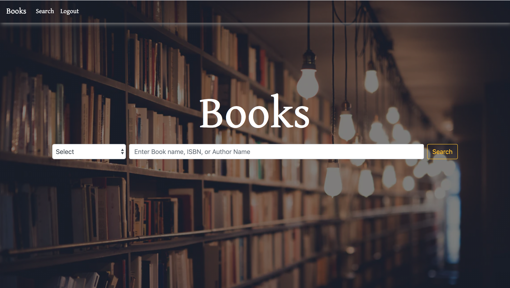
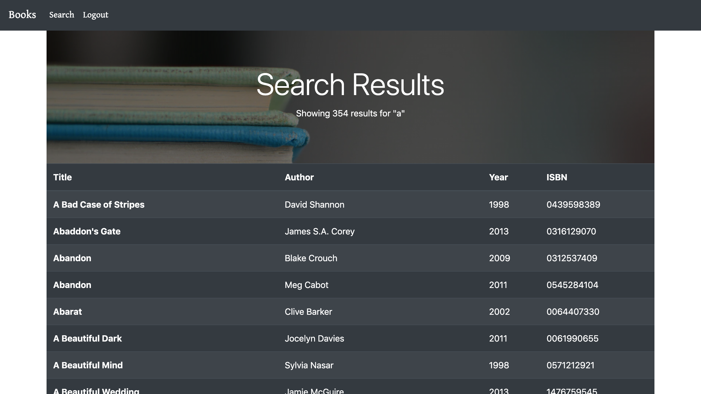
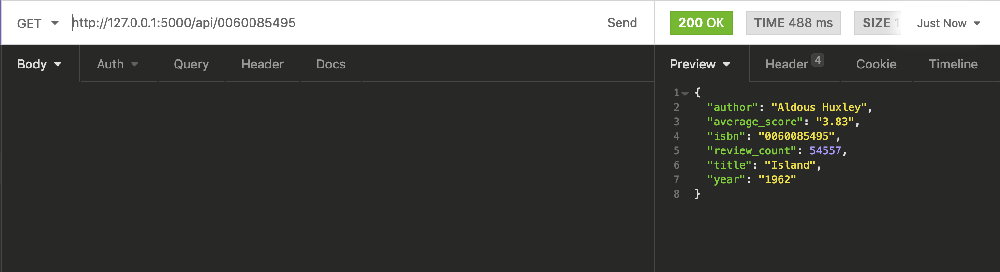

# Books CS50 Web Programming with Python
An app that allows users to create an account, search for a book via year, isbn, title, or author, leave a rating and review and see other users ratings. This app will also display ratings from goodreads API.

Built with: 
- Python
- Flask
- Flask_Session
- Postgres
- SQL ALCHEMY
- Jinja
- Sass / CSS
- GoodReads.com API

## Home Page:

## Search Results Page:

## Reviews Page:

## API
Along with this website, the app has a built in restful API that allows you to make a GET request with a book ISBN to route `/api/<string: isbn>` and it will return information such as title, author, year, review count and average rating. 

