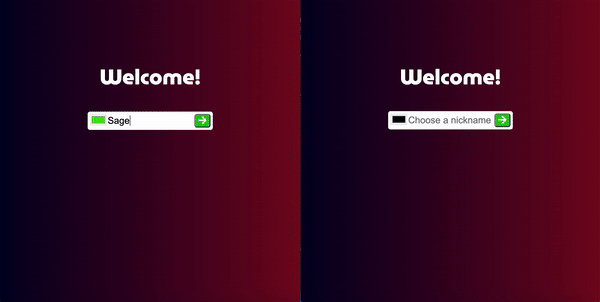

## Chat
A simple chat application made to teach students about the library socket.io. It uses sessionStorage to set nicknames and colors. It also stores messages server side (in an array no database, this project was made to just show off socket.io) and only emits previous messages to new users.

Built with:
- socket.io
- Node JS
- Express JS
- JavaScript
- HTML
- CSS
